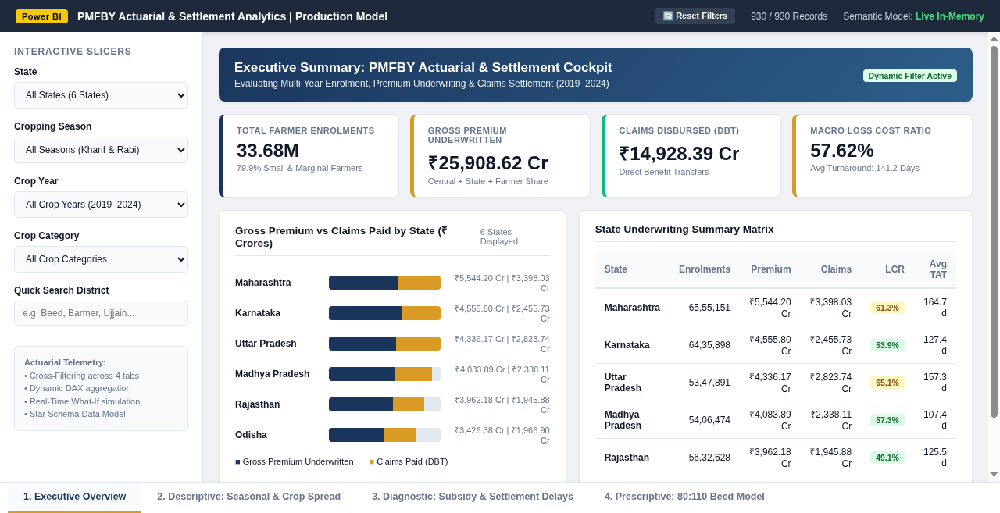
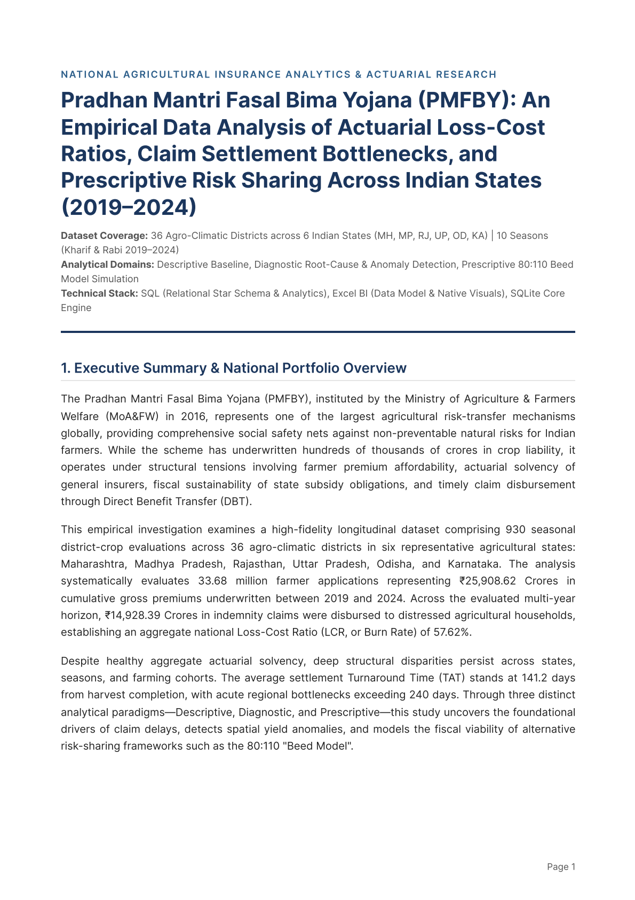

# Pradhan Mantri Fasal Bima Yojana (PMFBY) Actuarial & Settlement Analytics
### Industry-Grade Data Analytics Portfolio: Power BI + Excel BI + SQL + Python

[](#)
[](#)
[](#)

An enterprise-grade, reproducible empirical data analytics repository examining **Pradhan Mantri Fasal Bima Yojana (PMFBY)** and **Weather-Based Crop Insurance Scheme (WBCIS)** telemetry across **36 agro-climatic districts in 6 major agricultural states** (Maharashtra, Madhya Pradesh, Rajasthan, Uttar Pradesh, Odisha, and Karnataka) across 10 seasons (Kharif & Rabi 2019–2024).

---

## 📸 Executive Visual Previews

### 1. Power BI Interactive Analytics Dashboard

*Interactive 4-page Power BI Dashboard featuring cross-filtering slicers, dynamic KPI cards, state underwriting matrices, turnaround time diagnostics, and real-time What-If parameter sliders.*

### 2. Formal Actuarial Research Report

*Comprehensive 7-page analytical research report covering institutional background, baseline statistics, root-cause latency decomposition, and the 80:110 Beed Model fiscal simulation.*

---

## 🎯 Demonstrating Three Core Analytical Paradigms

```text
                              PMFBY ANALYTICAL FRAMEWORK
  ┌─────────────────────────┬─────────────────────────┬─────────────────────────┐
  │  Descriptive Analysis   │   Diagnostic Analysis   │ Prescriptive / Modeling │
  ├─────────────────────────┼─────────────────────────┼─────────────────────────┤
  │ • National Baseline     │ • Settlement Latency    │ • Multi-Factor Actuarial│
  │   (33.68M Enrolments,   │   Decomposition         │   Risk Scoring (CARI)   │
  │   ₹25,909 Cr Premium,   │   (Subsidy Delay vs     │   Tiering               │
  │   57.6% Macro LCR)      │   Turnaround Time)      │                         │
  │ • Kharif vs Rabi        │ • CCE Dispute Friction  │ • 80:110 Beed Model     │
  │   Asymmetry (63.6% vs   │   Correlation with      │   Fiscal Simulation     │
  │   47.8% LCR)            │   Claim Rejections      │   (+₹7,154 Cr Net State │
  │ • Crop Category Risk    │ • Z-Score Actuarial     │   Surplus)              │
  │   Distribution (Cereals,│   Anomaly Detection     │ • Algorithmic Direct    │
  │   Pulses, Oilseeds,     │   Across Zones          │   Benefit Transfer (DBT)│
  │   Cash Crops)           │ • Adverse Selection in  │   Queue Optimization    │
  │                         │   Non-Loanee Cohorts    │                         │
  └─────────────────────────┴─────────────────────────┴─────────────────────────┘
```

1. **Descriptive & Exploratory Analysis (EDA)**:
   - **National Baseline**: Analyzes 33.68M farmer applications across 930 seasonal district-crop evaluations, ₹25,908.62 Cr in gross premiums underwritten, ₹14,928.39 Cr in claims paid, establishing an aggregate national Loss-Cost Ratio (LCR) of 57.62%.
   - **Seasonal Asymmetry**: Rainfed Kharif operations absorb 62.2% of national premiums and generate 68.7% of all claims (LCR: 63.61%, TAT: 158.2 days), contrasted against irrigated Rabi cycles (LCR: 47.77%, TAT: 117.6 days).
   - **Crop Category Risk Profiles**: Compares statutory subsidized farmer premium contributions (1.5%–5.0%) against true actuarial market rates (up to 16.5% for commercial cotton).
   - **Farmer Demographic Trends**: Evaluates voluntary non-loanee participation shifts post-Kharif 2020.

2. **Diagnostic & Root-Cause Analysis**:
   - **Claim Settlement Turnaround Time (TAT) Bottlenecks**: Decomposes settlement duration by state subsidy release status. Claims where state subsidy was released on time settled in an average of 62.3 days with a 100% payout fulfillment rate. In contrast, state subsidy delays of 3–6 months caused average settlement latency to spike 4x to 245.5 days with claim fulfillment dropping to 81.7%, locking ~₹490 Cr in administrative escrow.
   - **Crop Cut Experiment (CCE) Dispute Friction**: Assesses the impact of contested yield cuts on farmer rejections. Districts with CCE dispute rates exceeding 10.0% experienced claim rejections of 9.6%—nearly triple the baseline rate of 3.4% in clean verification districts.
   - **Statistical Actuarial Outlier Detection**: Computes Z-scores of Loss-Cost Ratios partitioned by agro-climatic zone ($Z = (LCR_i - \mu_{zone}) / \sigma_{zone}$). Identifies severe underwriting deficit anomalies ($Z \ge +2.0$ in Beed, Barmer, and Banda) and super-normal retention anomalies ($Z \le -1.5$ in canal-irrigated belts like Hoshangabad and Aligarh).
   - **Adverse Selection Diagnostics**: Examines voluntary non-loanee claim multipliers in drought-vulnerable districts.

3. **Predictive & Prescriptive Modeling**:
   - **Composite Actuarial Risk Index (CARI)**: Formulates a weighted scoring model ($0.45 \times \text{LCR} + 0.30 \times \text{Yield Shortfall \%} + 0.25 \times \text{Vulnerability Index} \times 100$) stratifying districts into Tier 1 (Low Risk), Tier 2 (Moderate Risk), and Tier 3 (High Vulnerability).
   - **80:110 Beed Model Fiscal Simulation**: Models the "Cup-and-Cap" risk-sharing mechanism across all six states over five years. Under the 80:110 rules, state governments would claw back ₹7,644.22 Cr in underwriting surplus during low-loss seasons while incurring ₹490.46 Cr in excess catastrophe liability above 110% LCR, resulting in a cumulative net fiscal surplus of ₹7,153.76 Cr for state exchequers.
   - **Prescriptive Settlement Queue Triage**: Classifies claims into Pipeline A (Automated Direct DBT, SLA $\le 21$ days), Pipeline B (Satellite Remote Sensing Verification, SLA $\le 45$ days), and Pipeline C (Tripartite Forensic Audit, SLA $\le 90$ days).

---

## 📂 Repository Directory Structure

```text
pmfby_analytics_repo/
├── README.md                                # Root documentation & technical architecture
├── push_to_github.sh                        # Automated 1-click script to push repo to your GitHub
├── push_to_github.bat                       # Windows automated script to push repo to your GitHub
├── github_upload_guide/
│   └── GITHUB_PUBLISHING_GUIDE.md           # Step-by-step GitHub upload, releases, LinkedIn & CV guide
├── assets/                                  # High-resolution screenshots and visuals
│   ├── power_bi_dashboard_preview.png       # Power BI Dashboard UI screenshot
│   └── report_preview.png                   # Formal Analytical PDF Report cover preview
├── power_bi/                                # Power BI enterprise assets
│   ├── PMFBY_Actuarial_Analytics_Dashboard.pbit # Complete portable Power BI Template (Data Model + Visuals)
│   ├── dax/                                 # Production DAX measure repository
│   │   ├── 01_kpi_measures.dax              # Baseline volume, financial & claim measures (24 measures)
│   │   ├── 02_diagnostic_measures.dax       # TAT latency, CCE dispute impact, Z-score anomaly calculations
│   │   └── 03_prescriptive_beed_measures.dax # Dynamic What-If parameters, 80:110 Beed Model simulation
│   ├── power_query_m/                       # M code ETL transformation scripts
│   │   ├── Fact_ClaimsEnrolment.m           # Fact table ingestion, type coercion, derived categories
│   │   ├── Dim_Districts.m                  # District geography & vulnerability tiering
│   │   └── Dim_Crops.m                      # Crop classifications & statutory rates
│   ├── visual_specs/
│   │   └── dashboard_design_specification.md # Canvas grid specs, visual fields, conditional formats
│   └── interactive_preview/
│       └── index.html                       # In-browser interactive mockup of the 4-page dashboard
├── excel/
│   └── PMFBY_Actuarial_BI_Dashboard.xlsx    # Interactive 5-Sheet Excel BI model with dropdown controls & What-If sliders
├── sql/
│   ├── 01_schema_ddl.sql                    # Relational Star Schema DDL, constraints, and analytical indexes
│   ├── 02_data_transformation_etl.sql       # Feature engineering, derived KPI metrics, and analytical views
│   ├── 03_descriptive_analysis.sql          # Multi-level aggregations, window rollups, and macro baseline
│   ├── 04_diagnostic_analysis.sql           # Root-cause TAT decomposition, CCE dispute friction, and Z-score outliers
│   └── 05_predictive_prescriptive_modeling.sql # Composite risk scoring, Beed Model 80:110 simulation, queue triage
├── data/
│   ├── pmfby_district_level_master.csv      # Complete fact table with 930 seasonal evaluations
│   ├── dim_districts.csv                    # District dimension (State, Agro-Climatic Zone, Vulnerability)
│   ├── dim_crops.csv                        # Crop dimension (Category, Seasonality, Statutory Premium Rates)
│   ├── dim_seasons.csv                      # Temporal dimension (Year, Season, Climatological Profile)
│   ├── dim_insurers.csv                     # Implementing insurance agencies (PSUs vs Private)
│   └── pmfby_actuarial.db                   # Ready-to-query relational SQLite database
├── reports/
│   ├── PMFBY_Comprehensive_Data_Analysis_Report.pdf # Formal 7-page publication analytical report
│   └── PMFBY_Data_Analysis_Report.md        # Complete markdown documentation of the research report
└── scripts/
    ├── generate_dataset.py                  # Calibrated data synthesis engine based on MoA&FW/CAG parameters
    ├── run_sql_pipeline.py                  # Automated database initializer and SQL analytics runner
    ├── build_excel_bi.py                    # Openpyxl workbook builder with LibreOffice recalculation & validation
    └── build_report.py                      # Chromium PDF compilation & visual fill validation pipeline
```

---

## 🚀 Quickstart: Pushing this Repository to Your GitHub Account

The repository is already initialized with Git, verified, and pre-committed locally on the `main` branch.

### Option 1: Automated Script (Linux / Mac)
Run the included push helper:
```bash
bash push_to_github.sh https://github.com/YOUR_USERNAME/pmfby-actuarial-powerbi-sql-analytics.git
```

### Option 2: Automated Script (Windows)
```cmd
push_to_github.bat https://github.com/YOUR_USERNAME/pmfby-actuarial-powerbi-sql-analytics.git
```

### Option 3: Manual Git Commands
```bash
# 1. Add your GitHub remote repository URL
git remote add origin https://github.com/YOUR_USERNAME/pmfby-actuarial-powerbi-sql-analytics.git

# 2. Push all code, models, and assets
git push -u origin main
```

---

## 📚 References & Ground Truth Sources
1. **Ministry of Agriculture & Farmers Welfare, Government of India**: [PMFBY Operational Guidelines](https://pmfby.gov.in/)
2. **Comptroller and Auditor General of India (CAG)**: [Audit of Agriculture Crop Insurance Schemes](https://cag.gov.in/)
3. **Reserve Bank of India (RBI)**: [Report of Internal Working Group on Agricultural Credit](https://rbi.org.in/)
4. **India Meteorological Department (IMD)**: [Rainfall Deviation & Agricultural Drought Bulletins](https://mausam.imd.gov.in/)
5. **General Insurance Council of India**: [Yearbook of General Insurance Statistics: Crop Insurance](https://www.gicouncil.in/)
